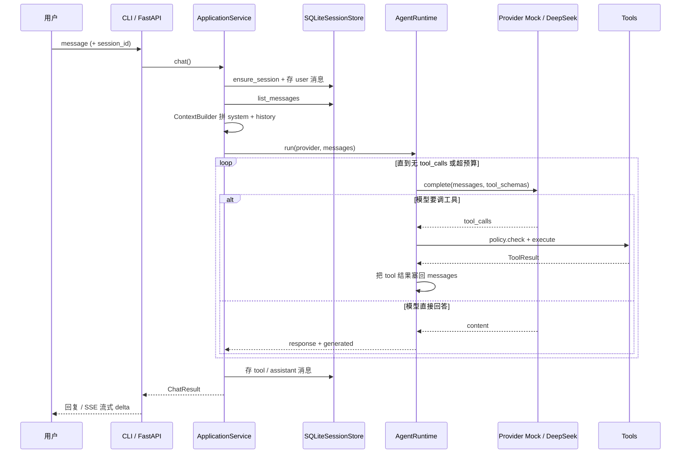
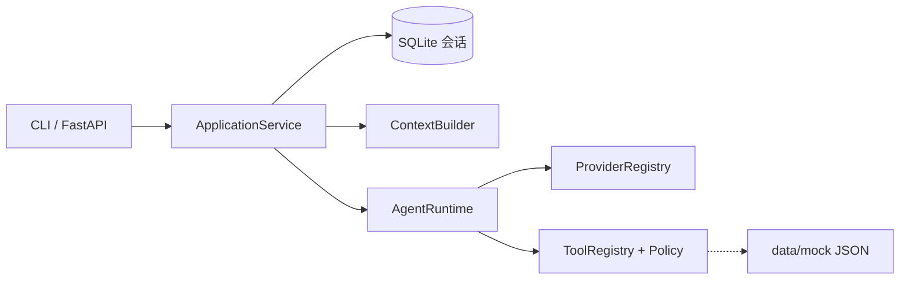

# CollabPilot

AI 达人合作工作台 Demo。用户用自然语言描述合作目标；Agent 读取模拟达人、判断匹配、不足时再搜，用户审核后生成触达草稿。不实际发送消息。

产品范围见 [`docs/AI笔试题目.md`](docs/AI笔试题目.md)。实现顺序与规格见 [`documents/PLAN.md`](documents/PLAN.md)。

## 目录

| 目录 | 职责 | Agent 运行时需要吗 |
|------|------|-------------------|
| [`frontend/`](frontend/) | Streamlit：左表右聊、工具状态栏 | 是（界面） |
| [`backend/`](backend/) | Agent：对话、工具、DeepSeek、会话库 | 是 |
| [`data/mock/`](data/mock/) | **达人资料 JSON（唯一数据源）** | **是（只读这两个文件）** |
| [`documents/`](documents/) | Task 规格包（Specify → Verify） | 否 |
| [`docs/`](docs/) | 笔试题目等说明 | 否 |
| [`tools/mockgen/`](tools/mockgen/) | 可选：用 seed 重新生成上面的 JSON | **否** |

`backend/data/` 只放本地会话 SQLite，和仓库根目录的 `data/mock/` 不是一类东西。

## 一轮对话怎么跑

入口是 CLI（`uv run agent chat`）或 FastAPI（`uv run agent serve` → `/v1/chat`、`/v1/chat/stream`）。二者都走同一个 `ApplicationService.chat()`，再进入 `AgentRuntime` 的工具循环。



结构关系（同一次请求里各模块怎么串）：



预算由 `config/config.yaml` 的 `runtime.max_model_calls` / `max_tool_calls` / `max_seconds` 约束；超限停止并报错。业务达人工具就绪后才会读 `data/mock/`。

## Agent 读什么

运行时 **只读 JSON**，不读 TypeScript，也不依赖 Node：

- [`data/mock/tiktok_creators.json`](data/mock/tiktok_creators.json)
- [`data/mock/instagram_creators.json`](data/mock/instagram_creators.json)

按 `creator_id` 合并跨平台达人。读取示例与字段说明见 [`data/README.md`](data/README.md)。

## 为什么有 TypeScript

`tools/mockgen/` 里的 `.ts`、`package.json` **不是 Demo 依赖**，只是造数工坊：

- 用固定 seed `20260926` 生成上面两个 JSON，保证结果可重复
- `types/*.ts` 只给生成脚本对齐字段名用

改业务逻辑、跑 Agent、交 Demo，都不需要安装 Node。只有你要改 mock 规则并重新生成 JSON 时，才进入该目录。

```bash
# 可选：重新生成模拟达人
cd tools/mockgen && npm install && npm run generate:mock
```

## 规格怎么推进

一次只做一个 Task。索引：[`documents/README.md`](documents/README.md)。当前应从 **T01** 开始。

界面约定：左栏数据表随工具结果更新，右栏对话 + 工具状态栏。详见 [`documents/PLAN.md`](documents/PLAN.md)。
