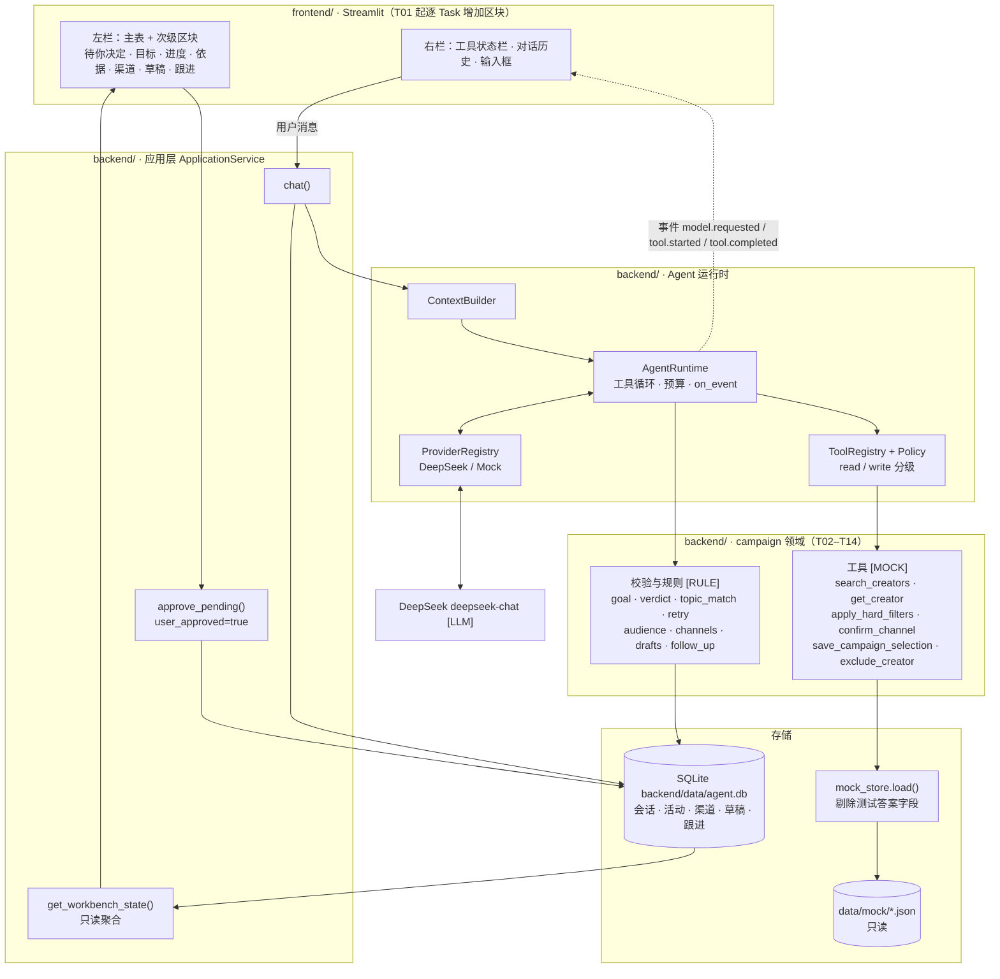
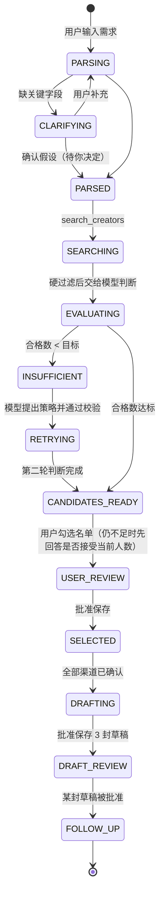
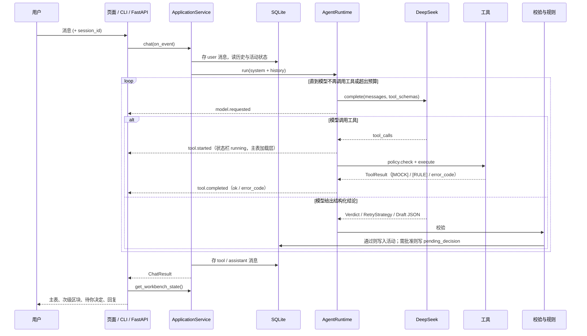

# CollabPilot

面向品牌和增长团队的 **AI 达人合作工作台 Demo**。用户用一段自然语言描述合作目标，系统理解目标、搜索达人、阅读内容判断是否适合、人数不够时调整策略再搜、整理候选名单，并为选中的达人准备个性化邀请草稿。重要动作都等用户批准，**不实际发送任何消息**。

产品范围见 [`docs/AI笔试题目.md`](docs/AI笔试题目.md)。实现顺序与验收规格见 [`documents/PLAN.md`](documents/PLAN.md)。

> **当前进度**：Agent 运行时骨架已可运行（CLI、FastAPI、Mock / OpenAI 兼容 Provider、工具循环、SQLite 会话）。业务流程按 T01–T14 的规格逐个实现，当前从 **T01** 开始。下文的架构描述的是目标形态，每个模块标明由哪个 Task 交付。

## 它做什么

示例需求：

> 为一款面向中文用户的 AI 翻译工具，找 10 位使用这个翻译工具的创作者。优先选择最近持续发布相关内容的人，排除已经合作过的账号。整理候选名单，并为最合适的 3 位准备合作邀请草稿。发送前让我审核。

系统的回应：

1. **理解目标**：抽出品牌、受众、平台、人数、筛选标准、排除条件。关键条件缺失时追问，其余写成假设展示给用户。
2. **搜索**：在 TikTok 与 Instagram 模拟数据中按关键词、时间窗口、粉丝门槛搜索，按创作者合并跨平台账号。
3. **判断**：模型阅读每位创作者的帖子与合作记录，给出「合适 / 待确认 / 不合适」、排名、理由和帖子引用；缺失信息标「未知」。
4. **调整**：合格人数不足时，模型根据首轮结果提出新的搜索策略（例如放宽时间窗口），说明旧值、新值和理由，再搜一次；仍不足就如实报告缺口，由用户决定是否接受。
5. **保存**：用户勾选并批准后保存到活动；再次运行同一任务不重复保存，也不再推荐已排除的人。
6. **触达**：确认沟通渠道后，为 3 位达人各写一封引用其真实内容的邀请草稿，等待用户审核；批准后生成跟进事项。

## 为什么是 AI native

题目的检验标准是「把模型拿掉，这条工作流就不在了」。本系统的分工：

| 环节 | 谁来做 | 拿掉模型会怎样 |
|------|--------|----------------|
| 理解合作目标、决定追问什么 | DeepSeek `[LLM]` | 无法开始，停在输入 |
| 判断是否适合、识别「关键词命中但主题不符」、排序 | DeepSeek `[LLM]` | 不产生任何候选名单，回复 `model_unavailable`，没有按粉丝数排序之类的备用名单 |
| 人数不足时提出新的搜索策略 | DeepSeek `[LLM]` | 返回 `model_strategy_required`，不会自动改条件 |
| 邀请草稿与跟进事项 | DeepSeek `[LLM]` | 不生成 |
| 排除已合作账号、核对引用是否为帖子原文、锁定主题不符者、受众未知时改判为待确认、校验策略是否越权 | 应用层规则 `[RULE]` | 规则只校验和锁定，不替模型判断 |
| 保存名单、确认渠道、保存与批准草稿、记下跟进 | 用户批准 | 未批准时返回 `approval_required` |

数据里给测试用的答案字段（例如 `keyword_mismatch` 标签）在运行时被剔除，模型和界面都看不到，只用于评测模型判断是否正确。

## 系统架构



| 层 | 位置 | 职责 | 交付 |
|----|------|------|------|
| 界面 | `frontend/` | 左表右聊；只展示和收集批准，不写业务规则，不直接读 `data/mock/` | T01 骨架，T02–T14 各加区块，T11 集成 |
| 应用层 | `backend/src/collabpilot/application.py` | 对话入口、页面只读聚合、统一批准入口 | 已有 `chat()`；其余 T02、T11 |
| 运行时 | `backend/src/collabpilot/agent/`、`providers/`、`tools/` | 工具循环、预算、事件、模型 Provider、工具权限 | 已有骨架；事件与 DeepSeek 默认值 T01 |
| 活动领域 | `backend/src/collabpilot/campaign/`、`tools/builtin/` | 业务工具、校验、规则、状态机 | T02–T14 |
| 存储 | `backend/data/agent.db`、`data/mock/` | 会话与活动状态；模拟达人只读 | 会话已有；活动表 T09 |

界面采用 Claude 设计系统（[`frontend/DESIGN.md`](frontend/DESIGN.md)）：奶油色底、衬线标题、深色工具状态栏与判断依据面板，珊瑚色只用于批准按钮。取用规则见 `documents/T11-dashboard/plan.md` 的「视觉映射」。

## 一次合作任务的状态



没有 `SENDING` 状态。所有需要用户批准的动作集中在左栏「待你决定」卡片，点击批准等价于在对话里回复「确认」。

## 一轮对话怎么跑

入口是 CLI（`uv run agent chat`）、FastAPI（`uv run agent serve` → `/v1/chat`、`/v1/chat/stream`）或 Streamlit 页面。三者都走同一个 `ApplicationService.chat()`，再进入 `AgentRuntime` 的工具循环。



预算由 `runtime.max_model_calls`、`max_tool_calls`、`max_seconds` 约束，超限停止并报错。T01 把演示预算设为 12 / 24 / 180。

## 来源标签

演示中每条信息都标明来源：

| 标签 | 含义 |
|------|------|
| `[MOCK]` | 来自 `data/mock/` 的模拟平台数据 |
| `[RULE]` | 应用层规则的结论或动作 |
| `[LLM]` | DeepSeek 实时输出，附 `deepseek-chat` |
| `[MOCK-SEND]` | 草稿与跟进不会发送 |

## 数据

运行时只读两个 JSON，不依赖 Node：

- [`data/mock/tiktok_creators.json`](data/mock/tiktok_creators.json)：23 个账号
- [`data/mock/instagram_creators.json`](data/mock/instagram_creators.json)：21 个账号

按 `creator_id` 合并后共 34 位创作者，其中 10 位跨平台。数据包含关键词命中但主题不符、已合作本品牌、受众未知、GPM 缺失、相关内容只有 1 条、相关内容只在 30 天之前等异常样本。演示期望：首轮合格 6/10，放宽时间窗口后 9/10，最终如实报告缺口。

字段分工、数据流与场景图见 [`data/README.md`](data/README.md)。

`tools/mockgen/` 是可选的造数工具（TypeScript，seed `20260926`），不是 Demo 依赖。只有要改演示场景时才进入该目录，改 `scripts/scenario-overrides.ts` 后重新生成：

```bash
cd tools/mockgen && npm install && npm run generate:mock
```

## 目录

| 目录 | 职责 | 运行时需要吗 |
|------|------|--------------|
| [`frontend/`](frontend/) | Streamlit 工作台与视觉规范 `DESIGN.md` | 是（界面） |
| [`backend/`](backend/) | Agent 运行时、业务工具、校验规则、SQLite | 是 |
| [`data/mock/`](data/mock/) | 模拟达人 JSON，唯一数据源 | 是（只读） |
| [`documents/`](documents/) | T01–T14 规格包（specify → plan → tasks → implement → verify） | 否 |
| [`docs/`](docs/) | 笔试题目 | 否 |
| [`tools/mockgen/`](tools/mockgen/) | 可选：重新生成模拟数据 | 否 |

`backend/data/` 只放本地会话库，和仓库根目录的 `data/mock/` 不是一类东西。

## 现在能跑什么

目前可运行的是运行时骨架（默认 `mock` provider，内置只读工具 `get_current_time`）：

```bash
cd backend
cp config/config.example.yaml config/config.yaml
cp .env.example .env
uv sync --python 3.11 --extra dev
uv run agent chat "现在几点？" --provider mock
uv run pytest
```

接入 DeepSeek：在 `backend/.env` 填 `DEEPSEEK_API_KEY`，运行 `uv run agent model test --provider deepseek --model deepseek-chat`。更多命令见 [`backend/README.md`](backend/README.md)。工作台页面的启动命令在 T01 完成后写入 [`frontend/README.md`](frontend/README.md)，完整的快速开始由 T12 补齐。

## 规格怎么推进

一次只做一个 Task，前一个的 `verify.md` 全部通过才开始下一个。每个 Task 同时交付后端和前端两部分。

| 顺序 | Task | 交付 |
|------|------|------|
| 1 | T01 | 会话、DeepSeek、工具事件；页面骨架与主题 |
| 2 | T02 | 理解目标、追问；「待你决定」卡片 |
| 3 | T03 | 按时间窗口搜索与跨平台合并 |
| 4 | T04 | 已合作硬过滤 |
| 5 | T05 | 模型判断适合度、证据与排序 |
| 6 | T06 | 模型识别关键词命中但主题不符 |
| 7 | T07 | 合格不足时由模型提出再搜策略 |
| 8 | T08 | 受众缺失标「未知」 |
| 9 | T09 | 保存名单与去重 |
| 10 | T13 | 确认沟通渠道 |
| 11 | T10 | 3 封邀请草稿 |
| 12 | T14 | 跟进事项 |
| 13 | T11 | 整页集成与视觉验收 |
| 14 | T12 | 来源标签、设计说明、演示脚本、两周计划、快速开始 |

索引与状态见 [`documents/README.md`](documents/README.md)。
