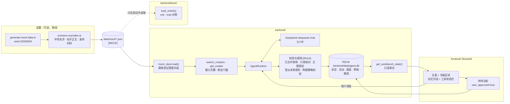
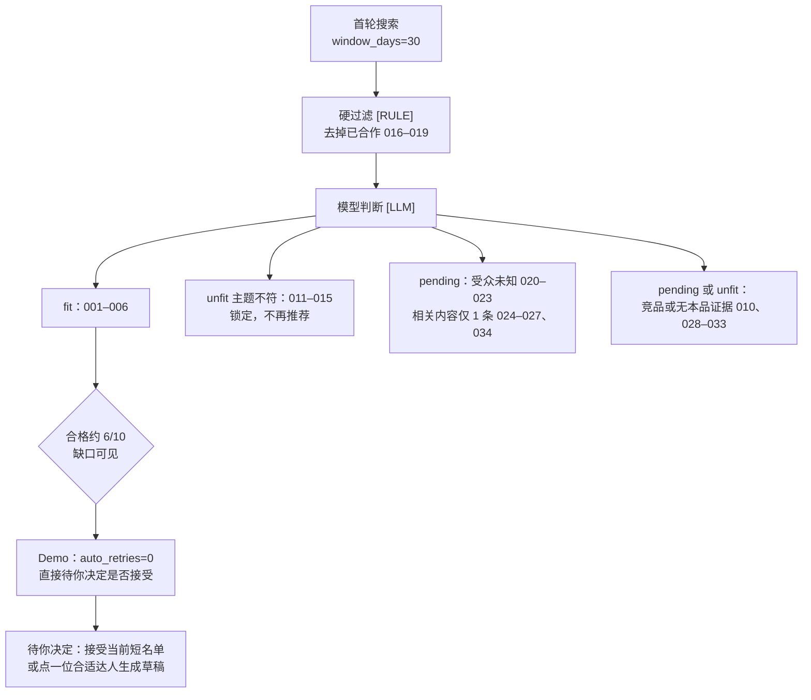

# Mock 达人数据

Agent 与 Demo **只读本目录的 JSON**。不要在这里预置模型判断或触达草稿。

## 文件

| 文件 | 用途 |
|------|------|
| [`mock/tiktok_creators.json`](mock/tiktok_creators.json) | TikTok 账号、帖子、合作、GPM、搜索/连接快照 |
| [`mock/instagram_creators.json`](mock/instagram_creators.json) | Instagram 账号、媒体、合作、扩展 GPM、搜索/连接快照 |

同一达人用相同 `creator_id` 和 `display_name` 关联。顶层都有 `meta.is_mock: true`。

## 架构：数据从哪来、到哪去



要点：

- 运行时唯一入口是 `mock_store.load()`，它返回的对象不含测试答案字段；模型和界面都看不到这些字段。
- 适合度、主题是否相符、再搜策略、草稿、跟进由 DeepSeek 产出；应用层只做校验、锁定和状态流转，不替模型判断。
- 前端不直接读本目录，只读 `get_workbench_state()`；用户批准经「待你决定」写回 SQLite。
- 本目录只读，运行时不写回。`backend/data/` 放的是会话库，和本目录不是一类东西。

## 字段怎么被使用

| 字段 | 谁读 | 说明 |
|------|------|------|
| `profile`、`content_topics`、`recent_posts`、`metrics`、`audience`、`cooperation_history`、`contact`、`product_usage_evidence`（去掉两个子字段） | 运行时：工具 → 模型 → 界面 | 帖子时间换算成相对 `meta.generated_at` 的 `age_days` |
| `cooperation_history[].is_current_brand` | 运行时规则 | 已合作本品牌的唯一判据 |
| `audience.status` | 运行时规则 | `unknown` 时阻止自动进入 fit |
| `scenario_tags`、`expected_ai_signals`、`product_usage_evidence[].product_relation`、`product_usage_evidence[].confidence` | 只在 `backend/tests/` | 测试答案，运行时剔除 |
| `search_snapshots`、`account_connection_snapshots` | 当前规格未使用 | 保留作模拟平台 API 响应样本 |

完整期望见 [`documents/PLAN.md`](../documents/PLAN.md) 的「模拟数据与测试答案」。

## 演示场景：期望走向

以下是评测期望，不是代码常量；实际结果以 DeepSeek 输出为准。



`creator_007`–`009` 的相关帖子发布于 40–73 天前，30 天窗口搜不到；若手动再搜并放宽窗口才会出现。昵称和帖子不含「新人」「二轮」提示，是否合适由模型读帖子判断。演示默认不自动再搜，以便首轮就看到合格不足 10。

## 读取方式

运行时通过 `backend/src/collabpilot/campaign/mock_store.py`（T03 实现）读取：

```python
from collabpilot.campaign import mock_store

creators = mock_store.load()          # creator_id → MergedCreator，已剔除测试答案字段
oracle = mock_store.load_oracle()     # 只在 backend/tests/ 中调用
```

写测试或排查数据时，可以直接读原始 JSON（含测试答案字段），不要把这段代码放进 `backend/src/`：

```python
import json
from pathlib import Path

mock = Path("data/mock")
tiktok = json.loads((mock / "tiktok_creators.json").read_text(encoding="utf-8"))
instagram = json.loads((mock / "instagram_creators.json").read_text(encoding="utf-8"))

by_id = {}
for c in tiktok["creators"]:
    by_id.setdefault(c["creator_id"], {})["tiktok"] = c
for c in instagram["creators"]:
    by_id.setdefault(c["creator_id"], {})["instagram"] = c
```

## 数据来源标记

| `data_origin` | 含义 |
|---------------|------|
| `mock_seed` / `mock_api_response` | JSON 内的模拟数据 |
| `real_model_output` | **不预置在 JSON**；Demo 运行时由 DeepSeek 生成再标记 |

缺失字段用 `null` 或 `"unknown"`，不编造。

## 规模（seed `20260926`）

TikTok 23 账号、Instagram 21 账号、34 个 Creator、10 个跨平台。帖子时间以 `2026-09-26` 为基准，除 `creator_007`–`009` 外都在 14 天内。

## 重新生成（可选）

**日常跑 Agent 不需要这一步。** 只有要改造数规则时才用。

生成脚本在 [`../tools/mockgen/`](../tools/mockgen/)（TypeScript）。`scripts/scenario-overrides.ts` 在写文件前覆盖名字、帖子正文、发布时间和部分期望；改演示场景改这个文件。输出仍是本目录的两个 JSON，**不是**给 Agent 编译用的类型包。

```bash
cd tools/mockgen && npm install && npm run generate:mock
```

重新生成后提交两个 JSON，并跑一遍 `backend/tests/` 确认期望没有漂移。

## GPM

```
gpm = gmv_30d / impressions_30d * 1000
```

已知：`gpm_origin: "mock_seed"`。缺失：`null` + `gpm_origin: "unknown"`。

## 异常场景怎么找

以下定位方式只用于写测试。运行时由模型读帖子判断，不读标签。

| 场景 | 怎么定位 |
|------|----------|
| 关键词命中但主题不匹配 | `scenario_tags` 含 `keyword_mismatch`（011–015）；012 的 GPM 28.1 高于目标 20 |
| 合格不足 10 | `first_round_pass`（001–006）与 `window_outside_30d`（007–009） |
| 相关内容只有 1 条 | `scenario_tags` 含 `single_related_post`（024–027、034） |
| 受众缺失 | `audience.status === "unknown"`（020–023） |
| GPM 缺失 | `metrics.gpm_origin === "unknown"` |
| 已合作本品牌 | `cooperation_history[].is_current_brand === true`（016–019） |
| API 401 | `search_snapshots` 里 `api_error_tt_001` / `api_error_ig_001` |
