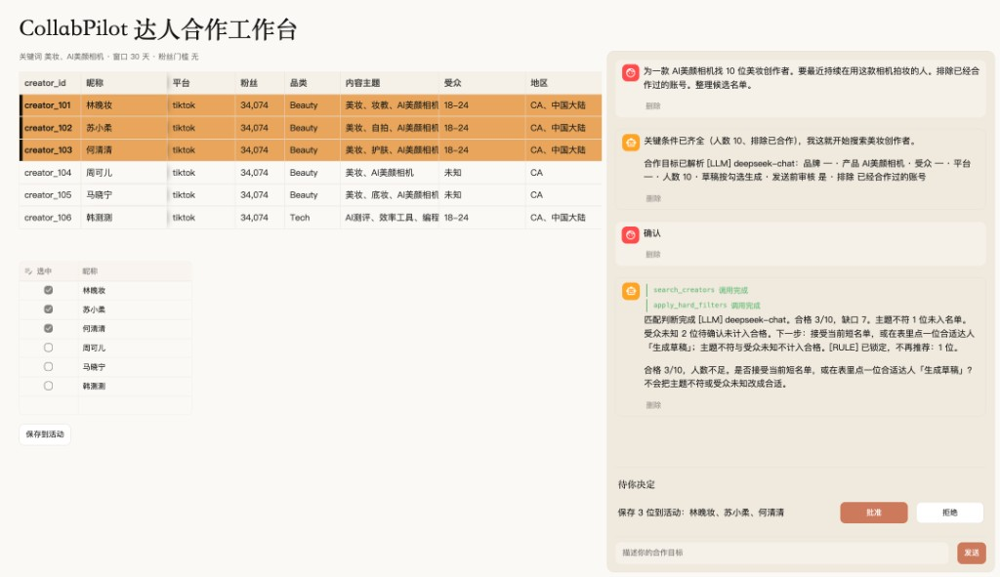
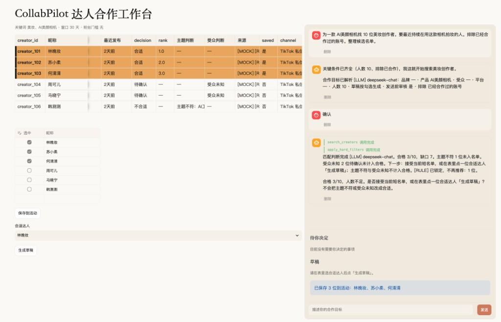

# 数据、判断、状态与审核

## 启动

在仓库根目录执行：

```bash
cd frontend && uv run --project ../backend --extra ui streamlit run app.py
```

浏览器打开 http://localhost:8501。假定 `backend/.env` 已有 `DEEPSEEK_API_KEY`。

## 数据从哪里来

达人资料来自仓库里的模拟数据，不连接真实的 TikTok 或 Instagram。

- 文件：`data/mock/tiktok_creators.json`、`data/mock/instagram_creators.json`
- 加载：`mock_store.load()` 只读这两份文件，按 `creator_id` 把同一人的两个平台账号合成一行
- 界面标 `[MOCK]`：昵称、粉丝、品类、内容主题、受众、地区、帖子、合作记录、联系渠道

## 哪些判断由模型完成

模型是 `deepseek-chat`，输出标 `[LLM]`。程序只校验，不替模型打分。


| 由模型做                                   | 由规则做（`[RULE]`）                |
| -------------------------------------- | ----------------------------- |
| 把需求解析成合作目标（品牌、产品、人数、平台、排除条件；缺的关键项标成假设） | 硬过滤：已合作本品牌、平台不在目标内            |
| 匹配判断：合适 / 待确认 / 不合适、理由、帖子引用、`rank`     | 主题不符校验通过后锁定，不再推荐、不再重判         |
| 人数不足时提出再搜策略（演示默认不自动再搜）                 | 受众未知不得判「合适」，改成「待确认」           |
| 邀请草稿正文、跟进的下一步文案                        | 时效与持续性由程序按相关帖子的 `age_days` 计算 |


## 任务状态如何保存

写在 SQLite：`backend/data/agent.db`（配置 `sqlite:///data/agent.db`，相对 backend 根目录）。刷新页面，或从侧栏切回该项目，对话和活动都还在。


| 表                     | 存什么                           |
| --------------------- | ----------------------------- |
| `sessions`、`messages` | 项目与对话                         |
| `campaigns`           | 目标、阶段、待决定事项、已保存 / 已排除 id、判断记录 |
| `creator_channels`    | 已确认的渠道                        |
| `drafts`              | 邀请草稿及待审核 / 已批准 / 已退回          |
| `follow_ups`          | 跟进                            |


## 哪些动作需要用户审核

搜索、硬过滤、匹配判断会直接跑。会改活动名单、渠道、草稿或跟进的动作，先出现在右栏「待你决定」，点**批准**才写入；拒绝则不动。入口是 `approve_pending`。

- 确认解析时补上的假设
- 接受一份仍少于目标人数的名单
- 保存候选名单、排除某位创作者
- 确认沟通渠道
- 保存草稿，以及逐封批准或退回
- 记录跟进、记下跟进

发送前审核默认打开，不会拿来追问。批准草稿之后仍然不发送。

## 界面

左栏是达人表，右栏是对话。

匹配判断完成后，表上是决策、排序和来源；勾选后保存仍要批准。





## 两周内完善计划：

1. 针对数据，找到替代模拟数据的API接口，MCP。模拟数据的评测有限制。
2. 优化整体流程，前端界面用户友好体验升级，用户引导升级，后端数据的CURD
3. 定制多种评测计划，确保软件的可行性。假设只有3个人符合，考虑信息不齐全的up，额外对接mcp，search engine 搜索up的更多信息，进行评判。

